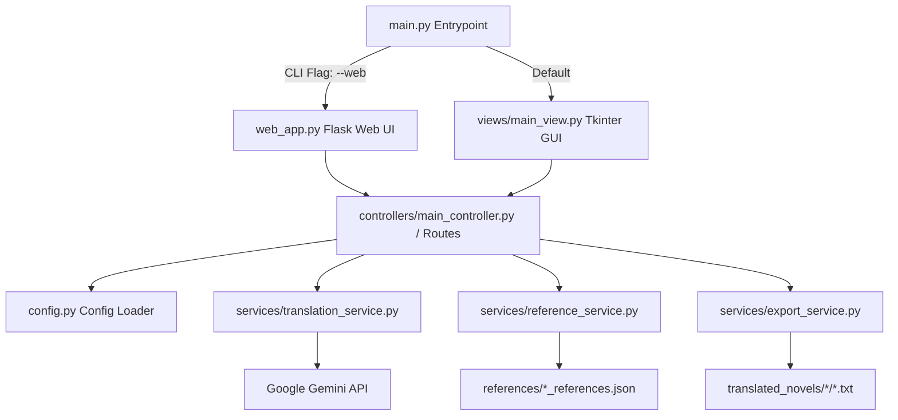

# Novel Translator & Compiler

An AI-powered translation and compilation suite designed specifically for translating web novels while maintaining character name and terminology consistency across chapters. It utilizes Google's Gemini models for context-aware translations and includes a compiler to bundle translated chapters into styled EPUB e-books.

---

## How It Works (Architecture)

The application follows a clean Model-View-Controller (MVC) architecture, separating the core translation, file export, and term referencing services from the interface representations.



### Core Components

1. **`config.py` (Configuration Loader)**
   - Manages base directories for prompt templates, reference glossaries, and exported novel chapters.
   - Loads your API key from the environment (`GEMINI_API_KEY`) or from a local `api_key.txt` file.

2. **`services/translation_service.py` (Gemini Integration)**
   - Configures the `google-generativeai` SDK.
   - Dynamically retrieves available Gemini models.
   - Builds targeted translation prompts injecting the source text, target language, and relevant glossary references.

3. **`services/reference_service.py` (Glossary & Term Matching)**
   - Saves and loads glossary lists (`references/<novel_name>_references.json`).
   - **Smart Filtering:** Matches original words/names in the source text and filters the dictionary before sending it to Gemini, significantly reducing API token consumption and model noise.
   - Parses newly introduced characters recommended by the Gemini API from the translation output and appends them to the dictionary.

4. **`services/export_service.py` (Chapter Export)**
   - Organizes, sanitizes, and writes translated chapters to disk in structured paths (`translated_novels/<novel_name>/<novel_name>_<chapter_number>.txt`).
   - Automatically calculates next chapter numbers sequentially.

5. **`Novel Compiler.py` (E-book Packager)**
   - A standalone Tkinter GUI application designed to package compiled text files into standard `.epub` files.
   - Supports cover images, chapter sorting (alphanumeric/natural sorting), and customizable stylesheet formatting.

---

## Setup & Installation

### 1. Prerequisites
Install the required dependencies using pip:
```bash
pip install google-generativeai flask ebooklib beautifulsoup4 lxml
```

### 2. API Key Configuration
Create a file named `api_key.txt` in the root directory and paste your Google Gemini API key inside it:
```
AIzaSy...
```
*(Alternatively, you can export `GEMINI_API_KEY` into your system environment variables).*

---

## How to Run

### Run the Desktop GUI
To launch the native Tkinter GUI for translating chapters:
```bash
python main.py
```

### Run the Web Interface
To launch the Flask web application in your browser (default: `http://127.0.0.1:5000`):
```bash
python main.py --web
```

### Run the Novel Compiler
To compile your translated chapter text files into an EPUB e-book:
```bash
python "Novel Compiler.py"
```
